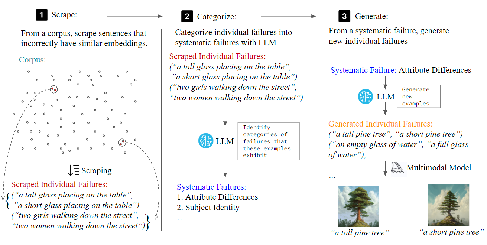

#  Mass-Producing Failures of Multimodal Models with Language Models

[](https://arxiv.org/abs/2304.03977)



Authors: Shengbang Tong*, Erik Jones*, Jacob Steinhardt

### Running and Using MultiMon

#### Step 0: Install the necessary Python packages
```
pip install -r requirements.txt
```

#### Step 1: Scraping from corpus data

You will need to run the `scrape.py` file. This file contains arguments that can be adjusted according to your needs:

- `steer`: Steering direction for the self-driving car (default is "self-driving cars").
- `corpus_data`: Corpus data to scrape (default is "MS-COCO").
- `num_output`: Number of entries we want (default is 150).
- `api_key`: API Key for your openAI account (default is empty).
- `do_steer`: Execute steering direction (default is False).

To run the script, navigate to the directory containing `scrape.py` in your terminal, and type:

```
python scrape.py --steer [your_value] --corpus_data [your_value] --num_output [your_value] --api_key [your_value] --do_steer [your_value]
```

#### Step 2: Categorizing systematic failures
After scraping the corpus data, replace the failure instances with the scraped failure instances and prompts LLM (GPT-4 or Claude)
```
I will provide a series of data for you to remember. Subsequently, I will ask you some questions to test your performance! Here are some pairs of prompts for you to memorize. 
[Copy paste the failure instances scraped in csv file from previous step]

I’m trying to find failures with an embedding model. The above are some pairs of sentences that it encodes very similarly, even though they’re conveying different concepts. Using these specific examples, are there any general types of failures you notice the embedding is making, or any common features that the embedding fails to encode? Try to give failures that are specific enough that someone could reliably produce examples that the embedding would encode similarly, even though it shouldn’t. Please try to give as many general failures as possible. Please focus on differences that are important visually, as these embeddings are later used to generate images, or videos. In your failure modes, please explain clearly why the failure would lead to problems for future tasks related to visual generation.Please summarize as many as you can and stick to the examples.
```


#### Step 3: Categorizing systematic failure
For a categorized systematic failure, prompt LLM to generate new failure instances by 
```
Write down 41 additional pairs of prompts that an embedding model with the following failure mode might encode similarly, even though they would correspond to different images if used as captions. Use the following format:
("prompt1", "prompt2"),
("prompt1", "prompt2"),
You will be evaluated on how well you actually perform. Your sentence structure and length can be creative; extrapolate based on the failure mode you’ve summarized. Be both creative and cautious.
Failure Mode:
[Systematic Failure (with full description)]
```

Try the generated failure instances on Multimodal models such as MidJourney, Stable Diffusion, etc :D.

#### See also

For a more detailed demonstration, see the [Full Demo](Demo/demo.md) walkthrough.

### Trying the user study in our work
For both baseline produced failure instances and MultiMon produced failure instances, we choose a text-to-image model. We generate an image for each input, then ask two whether each the image corresponds to input 1, input 2, neither input, or if the inputs are visually indistinguishable. We say pair is a downstream failure if at least one image is labeled with an incorrect input, or with “neither”.
To try the user study, run 
```
python annotate.py
```
Your results will be automatically reocrded in User_Study.csv, you can compare your answer with the ground truth in User Study (Answers).xlsx


## Citation
If you find this repository useful, please consider giving a star :star: and citation:

```
@misc{tong2023massproducing,
      title={Mass-Producing Failures of Multimodal Systems with Language Models}, 
      author={Shengbang Tong and Erik Jones and Jacob Steinhardt},
      year={2023},
      eprint={2306.12105},
      archivePrefix={arXiv},
      primaryClass={cs.LG}
}
